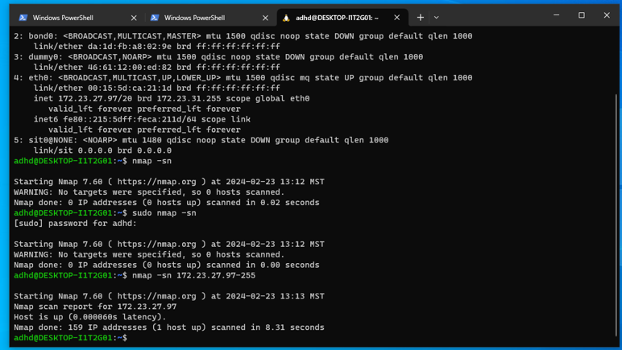
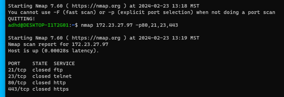
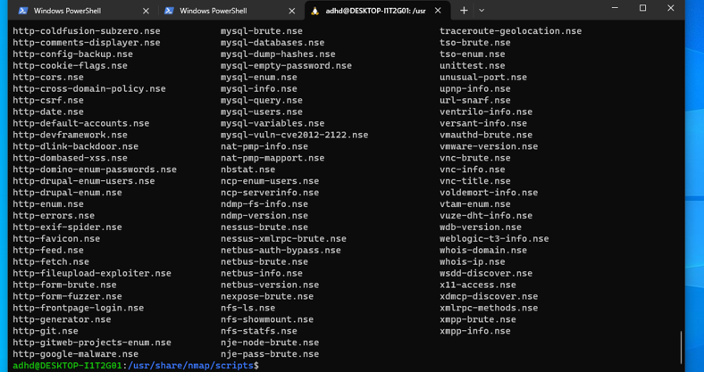
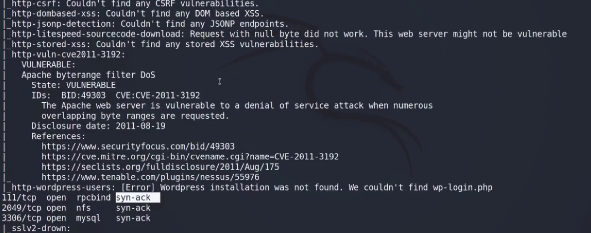
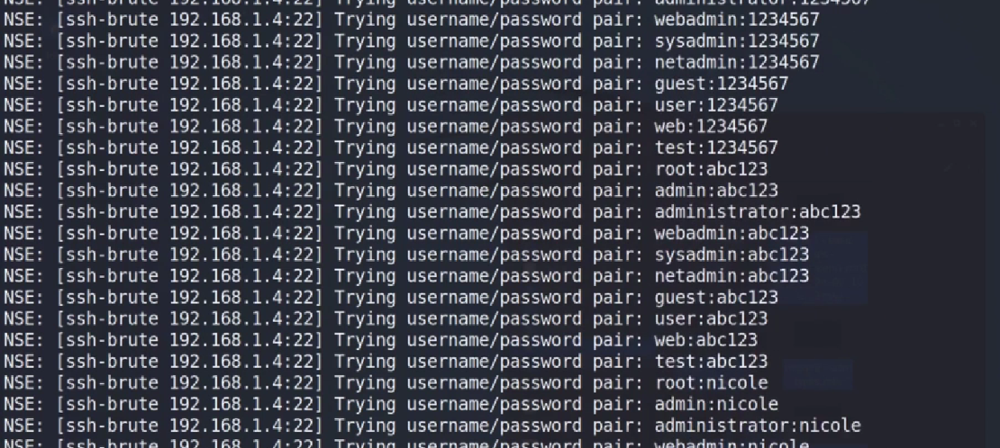

# Nmap

Nmap (Network mapper) is an open-source Linux tool for network and security analysis. The tool helps network administrators reveal hosts and services on various systems.

Nmap works both locally and remotely. Typical uses include host discovery, scanning for open ports, discovering vulnerabilities in a network, network mapping, and maintenance. The tool is valuable from both a security and networking standpoint.

First, I scanned all the subnets to find all hosts 

nmap –sn (the ip address)-255 

 

 

Next, I wanted to see which ports were open or closed:

nmap (ip address) –p80,21,443 

 

 

Nmap has scripts which enable you to run exploits.

To see the list of scripts available for nmap, first go to all the directories 
cd usr/share/nmap

Then if you want to go to the script directory, go to cd scripts  
and then  ls 

 

 

Looking for vulnerabilities in a system is obviously a useful part of analysis and threat hunting.

I used the following script to look for vulnerabilties

sudo nmap --script=vuln 192.168.1.235/20 -vv 

 

 

First, I found the open ports

nmap –sT (ip add) -p-

And then, used nmap to use brute force scripts to attempt to take control of a host (eg using SSH, HTTP protocols/ports and others) ie tries different passwords.

 

 

Hope you enjoyed the walkthrough of the project!

